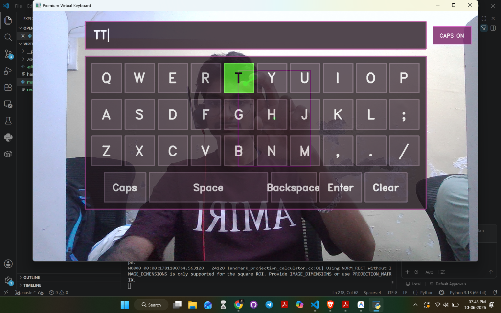

# Virtual Keyboard using CV

Hey! Here's a Python script that turns your webcam into an interactive virtual keyboard using computer vision. 

It tracks your hand using MediaPipe and `cvzone`, letting you type on a floating glass-like keyboard. When you pinch your index finger and thumb together, it registers a keypress and inputs it directly into whatever active window you have open (Notepad, VS Code, search bars, etc.).

We made the keyboard panel super translucent so it doesn't block your camera view, but kept the keys clear enough to read.



## How it works
- **Hover**: Move your index finger tip over any key to highlight it.
- **Click**: Pinch your index finger and thumb tip together.
- **Visuals**: You'll see a connection line between your thumb and index finger. It turns green when they touch, indicating a press. The pressed key will also flash green.
- **Caps Lock**: Click the `Caps` button on the screen to switch between uppercase and lowercase.
- **Special Keys**: Has `Space`, `Backspace` (deletes characters), `Enter`, and a `Clear` button to wipe the text bar.

## Setup & Run

### 1. Install dependencies
Make sure you have Python installed, then run:
```bash
pip install -r requirements.txt
```

### 2. Run the keyboard
Run the script from your terminal:
```bash
python main.py
```

### 3. Controls & Exit
- Hover your index finger over the keys.
- Pinch index and thumb tips to press.
- With the OpenCV window selected, press **`q`** on your hardware keyboard to stop and exit.
